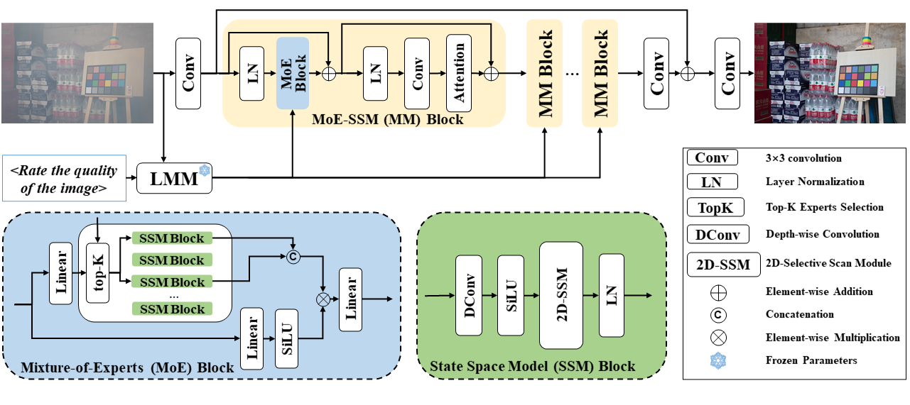

<p align="center">
    
</p>


## LMHaze
official implementation of paper "LMHaze: Intensity-aware Image Dehazing with a Large-scale Multi-intensity Real Haze Dataset".

### [[Paper](https://arxiv.org/abs/2410.16095)]
[Ruikun Zhang](https://scholar.google.com/citations?user=8rabqgoAAAAJ&hl=en), [Hao Yang](https://github.com/noxsine), [Yan Yang](https://scholar.google.com/citations?user=IF0xw34AAAAJ&hl=en), Ying Fu, and [Liyuan Pan](https://scholar.google.com/citations?user=kAt6-AIAAAAJ&hl=en)\*

> **Abstract:**  Image dehazing has drawn a significant attention in recent years. Learning-based methods usually require paired hazy and corresponding ground truth (haze-free) images for training. However, it is difficult to collect real-world image pairs, which prevents developments of existing methods. Although several works partially alleviate this issue by using synthetic datasets or small-scale real datasets. The haze intensity distribution bias and scene homogeneity in existing datasets limit the generalization ability of these methods, particularly when encountering images with previously unseen haze intensities. In this work, we present LMHaze, a large-scale, high-quality real-world dataset. LMHaze comprises paired hazy and haze-free images captured in diverse indoor and outdoor environments, spanning multiple scenarios and haze intensities. It contains over 5K high-resolution image pairs, surpassing the size of the biggest existing real-world dehazing dataset by over 25 times. Meanwhile, to better handle images with different haze intensities, we propose a mixture-of-experts model based on Mamba (MoE-Mamba) for dehazing, which dynamically adjusts the model parameters according to the haze intensity. Moreover, with our proposed dataset, we conduct a new large multimodal model (LMM)-based benchmark study to simulate human perception for evaluating dehazed images. Experiments demonstrate that LMHaze dataset improves the dehazing performance in real scenarios and our dehazing method provides better results compared to state-of-the-art methods. The dataset and code are available at our github page.




## 📑 Contents
code will be released later!

- [News](#news)
- [TODO](#todo)
- [Dataset](#dataset)
- [Citation](#cite)


## <a name="news"></a> 🆕 News

- **2024-10-04:** :fire: :fire: :fire: Congratulations! Our paper has been accepted by **ACM MMAsia 2024**！
- **2024-10-21:** arXiv paper available.
- **2024-10-22:** Congratulations! Our paper has been selected as an Oral presentation at **ACM MMAsia 2024**! 🎉
- **2024-10-24:** This repo is released.
- **2024-11-24:** The LMHaze training and test sets have been released! 🎉 We will release training and test code soon~


## <a name="todo"></a> ☑️ TODO

- [x] Build the repo
- [x] arXiv version
- [ ] Release code
- [x] Release dataset
The code will come soon!

## <a name="todo"></a> 📂 Dataset

| Dataset                                       |                         BaiduNetDisk link                    |                         extraction code                      |
| :-------------------------------------------- | :----------------------------------------------------------: | :----------------------------------------------------------: |
| train set                                     | [train set](https://pan.baidu.com/s/1IfNMVB16vfLY6nlNjgXqdQ) (3925 image pairs) | 52zz | 
| test set                                      | [test set](https://pan.baidu.com/s/1LTntZHargILIQSsdCLe69Q) (1115 image pairs)  | 52zz |


## <a name="cite"></a> 🥰 Citation

```
@article{zhang2024lmhaze,
  title={LMHaze: Intensity-aware Image Dehazing with a Large-scale Multi-intensity Real Haze Dataset},
  author={Zhang, Ruikun and Yang, Hao and Yang, Yan and Fu, Ying and Pan, Liyuan},
  journal={arXiv preprint arXiv:2410.16095},
  year={2024}
}
```

## License

This project is released under the [Apache 2.0 license](LICENSE).

## Acknowledgement

The code is borrowed from the following repositories, thanks for sharing.
- [BasicSR](https://github.com/XPixelGroup/BasicSR)
- [ART](https://github.com/gladzhang/ART)
- [VMamba](https://github.com/MzeroMiko/VMamba)
- [MambaIR](https://github.com/csguoh/MambaIR)

## Contact

Feel free to contact me at **ruikun.zhang@bit.edu.cn** if you have any questions.


